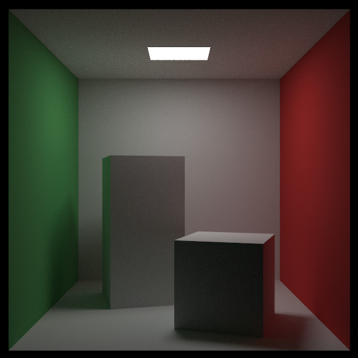
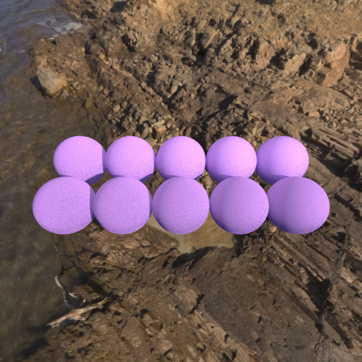
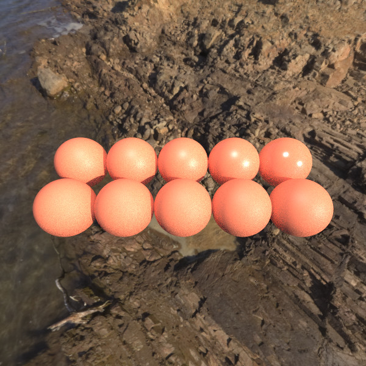
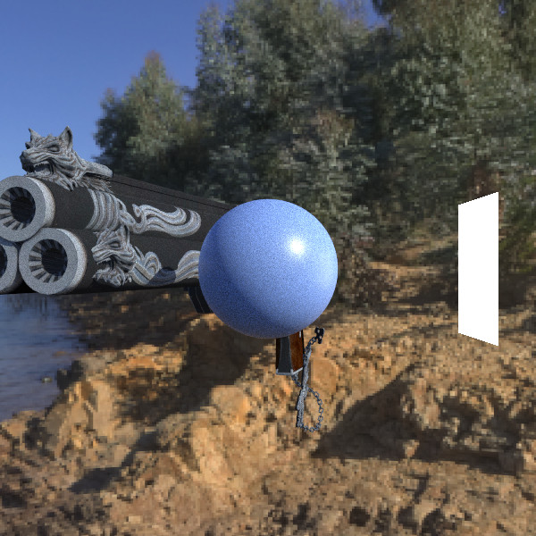
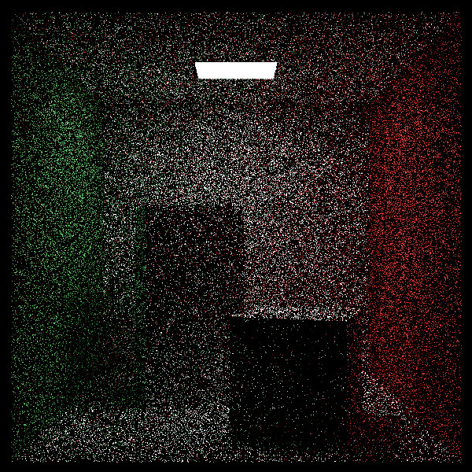
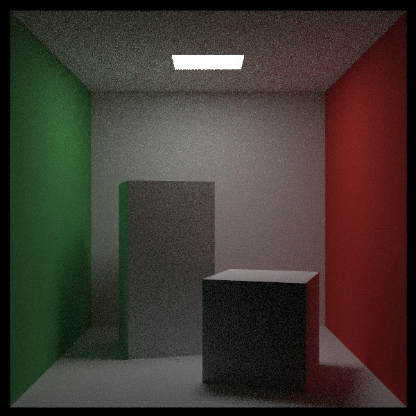
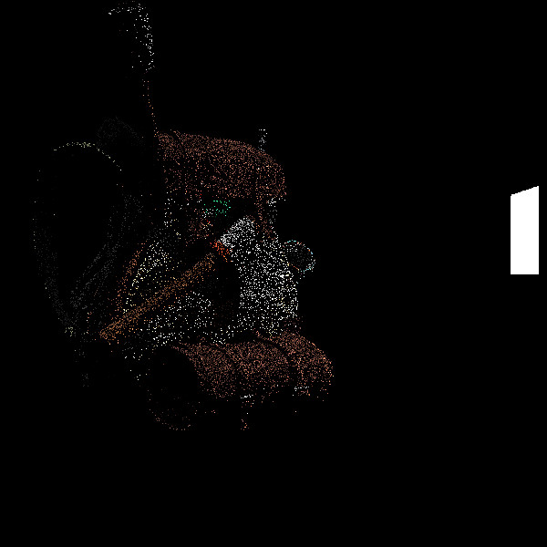
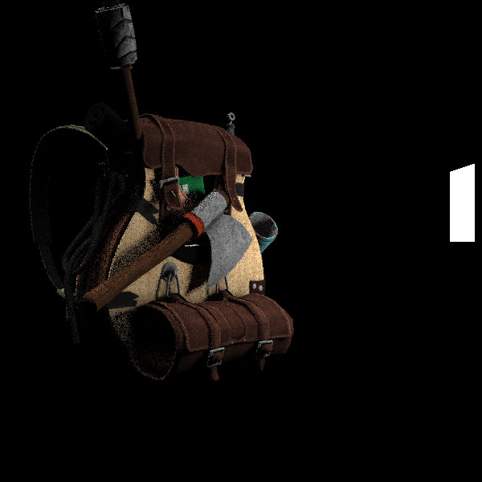
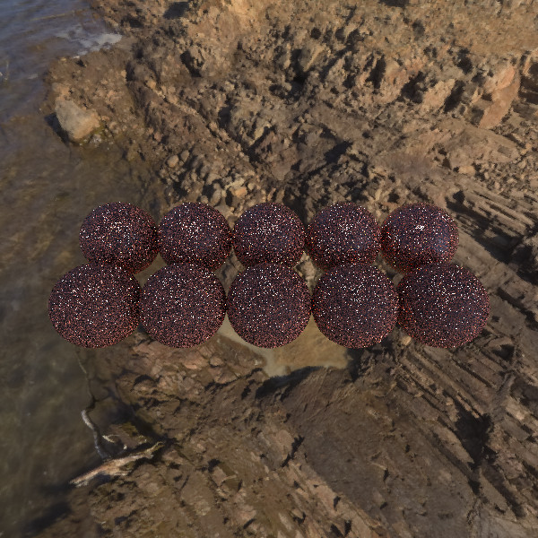
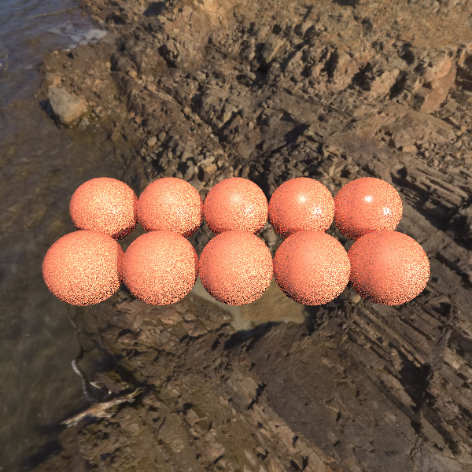

AurelRayTracer
=========

- [AurelRayTracer](#aurelraytracer)
  - [Description](#description)
  - [Gallery](#gallery)
    - [Cornell Box](#cornell-box)
    - [Oren Nayar](#oren-nayar)
    - [Plastic material with Torrance-Sparrow reflection](#plastic-material-with-torrance-sparrow-reflection)
    - [A model with diffuse texture and a plastic sphere](#a-model-with-diffuse-texture-and-a-plastic-sphere)
    - [Comparisons between a basic path tracer and my main integrator](#comparisons-between-a-basic-path-tracer-and-my-main-integrator)
  - [Important notice (the current status)](#important-notice-the-current-status)
  - [Building and running](#building-and-running)
    - [Dependencies](#dependencies)
    - [Building the project](#building-the-project)
  - [How to use](#how-to-use)
  - [Acknowledgments and nice resources](#acknowledgments-and-nice-resources)

Description
-----------

**Scroll down to see a couple of pictures!**

A playground C++ project centered around physicaly based rendering.
It features a CPU path tracer integrator, using direct lighting with both BSDF and light importance sampling (both area lights and image-based environment lighting). I also added a couple of PBR reflection models (Torrance Sparrow, Oren Nayar) and used them in some mixture-BSDFs (a plastic material, for example). Intersection computations were originally done with a BVH using axis-aligned slabs, but are now done with Embree.

Gallery
-------

Below are some of the scenes that are rendered when running the executable. 

Unless specified otherwise, all scenes are run with a path tracer integrator with direct lighting. Direct lighting uses both BSDF and light sampling. For light sampling, I do importance sampling on both triangular (or rectangular, but that's the same) lights and environment lighting. To mix the PDFs I use the power 2 heuristic from PBR-book (see the *Acknowledgments* section). This integrator's principle corresponds to the PathTracer from the *Light Transport 1* chapter of *PBR-book*.

In the *media* folder you will find a lot of additional images:
* **areaLight_noEnvironment_PTDL_256samples_50bounces**: These scenes just use a single rectangle light. They were rendered using 256 samples per pixel.
* **comparing_basicPathTracer_against_importanceSamplingPTDL**: These scenes are rendered with both a basic path tracer, and the integrator described above, with 10 samples per pixel, for comparison.
* **environmentLight_and_areaLight_PTDL_256samples_50bounces**: These scenes use both an environment light and a rectangle light, and use the main integrator described above. They use 256 samples per pixel.
* **renderTestsStatus**: This folder contains all the images that would be produced by running the project executable, so you don't have to :)
* **TODO_fixing_dielectrics**: This scene shows the broken scenes. I was working a lot on my integrator lately and I broke the pure specular and the Torrance-Sparrow based dielectrics, but I still put the scenes, for information.

### Cornell Box ###

The result is exactly the same as the dev-major version of the RayTracingTheRestOfYourLifeBook,
except with much less noise (see the *Acknowledgments* section).

### Oren Nayar ###

Oren Nayar matte materials with varying Sigma parameter with environment lighting and a rectangle light above (off-screen)

### Plastic material with Torrance-Sparrow reflection ###

Plastic material (mixture of Lambertian and Torrance Sparrow) with varying glossiness (from top right to bottom left) with environment lighting and a rectangle light above (off-screen)

### A model with diffuse texture and a plastic sphere ###

I did not take the time to work on a meta-material for all model textures with this project, and instead used separate materials. This will be done later, with a much cleaner ray tracing project ;)

### Comparisons between a basic path tracer and my main integrator ###

Both are implemented by me within this project. The ugly pictures are from my basic path tracer, and the other ones are from the integrator described above.
Note that the path tracer produces the same results as the path tracer from the RayTracingTheNextWeek book, tested on a Cornell Box (see the *Acknowledgments* section).

**All scenes are rendered with 10 samples per pixel**.

|  |
| :--------------------------------------------------------------------------------------------------------------------------------------------------------------------: |
|                                                                   Cornell Box with basic path tracer                                                                   |

|  |
| :----------------------------------------------------------------------------------------------------------------------------------------------------------------------------------------------: |
|                                                                               Cornell Box with the main integrator                                                                               |

|  |
| :--------------------------------------------------------------------------------------------------------------------------------------------------------------------------: |
|                                        Bag with basic path tracer (rectangle light and a "sun" environment light shining from above)                                         |

|  |
| :------------------------------------------------------------------------------------------------------------------------------------------------------------------------------------: |
|                                                                              Bag with the main integrator                                                                              |

|  |
| :--------------------------------------------------------------------------------------------------------------------------------------------------------------------------------------------------: |
|                                                  Plastic spheres with basic path tracer (environment light and rectangle light above (off-screen))                                                   |

|  |
| :------------------------------------------------------------------------------------------------------------------------------------------------------------------------------------------------------------: |
|                                                                                    Plastic spheres with the main integrator                                                                                    |

Important notice (the current status)
-------------------------------------

**This project is an evergoing work in progress**, as it was mostly used for self-teaching. I did not take the time to clean it up yet and I am in the middle of bugfixes. However it is buildable and runable if you want to take a look! See the *Building and Running* section :)

**Elements that were implemented, worked at some point, but don't work anymore (or were removed) include:**
* Dielectrics with torrance sparrow reflection and transmission ("rough" dielectrics)
* Mirror and lambertian transmission material models (the latter has been removed from the code base).
* Russian roulette path termination from *PBR-book* was implemented but was removed, because it generates some variance and I first needed to get rid of the variance induced by everything else. I use a max bounces limit instead (set at 10 in the main, but changeable).

**Elements that would need a nice refactoring include (but are certainly not limited to)**
* Embree integration. I integrated Embree mostly to gain time with rendering (which it does for me), but I am sure I don't use it the optimal way. It is still slow especially with the Cornell Box, if one sets the max bounces number to a high value.
* Memory management. I think about recoupling materials and BSDFs, for example.

I will either clean them up, or just **start over** with all the knowledge I accumulated doing this, and make a better, clean ray tracer. This, after all, is a 6 months project.

I still believe it is a fun project with some interesting things, and I hope you like it!

Building and running
--------------------

### Dependencies ###

Everything is embedded in the external folder. You should not have to add anything and can build the project as it is.
However, **if you experience opengl-related problems**, you might want to replace the glad library and include in the external folder with a version that suits your setup. I use opengl for the viewer.

In general, if any library is giving you a hard time, you can specify a path to your own installation in the *.env.cmake* file, or modify *CMakeLists.txt*. By default all libraries, headers and DLLs are fetched from the *external* folder.

The following (lib and headers) are included in the external folder:
* [GLFW](https://github.com/glfw/glfw)
* [Assimp](https://github.com/assimp/assimp)
* [Embree](https://github.com/embree/embree)
* [GLAD](https://glad.dav1d.de/)

The following (headers only) are also included in the external folder:
* [STB image](https://github.com/nothings/stb/blob/master/stb_image.h)
* [GLM](https://github.com/g-truc/glm)

### Building the project ###

To configure the project, run

> cd AurelRayTracer && cmake .

CMake might ask you to specify a generator, in the case please use "Visual Studio 16 2019".

You can also use CMake-GUI of course.

Then open the .sln file with *Visual Studio (2019 or later)* and build the project. This should create the *AurelRayTracer.exe* file in the project source directory.

How to use
----------

**Launch *AurelRayTracer.exe* from the project root**. This will render the many test scenes I use and produce ppm images in the root folder.

The *main* function in *RenderTests.cpp* sets up the path tracer. You can change the parameters of the integrator, located at the top of the function, if you want to play around :)

**If you can't launch the project for any reason**, you can find all the images as they would be rendered with the current project in the "*media/renderTestsStatus*" folder.

Acknowledgments and nice resources
----------------------------------

Thanks to all these invaluable resources:
* The bible: [PBRT](https://www.pbr-book.org/)
* A very good introductory series: [Ray Tracing In Series](https://raytracing.github.io/)
* And a very nice course on ray tracing: [TU Wien - Ray Tracing](https://www.youtube.com/playlist?list=PLujxSBD-JXgnGmsn7gEyN28P1DnRZG7qi)